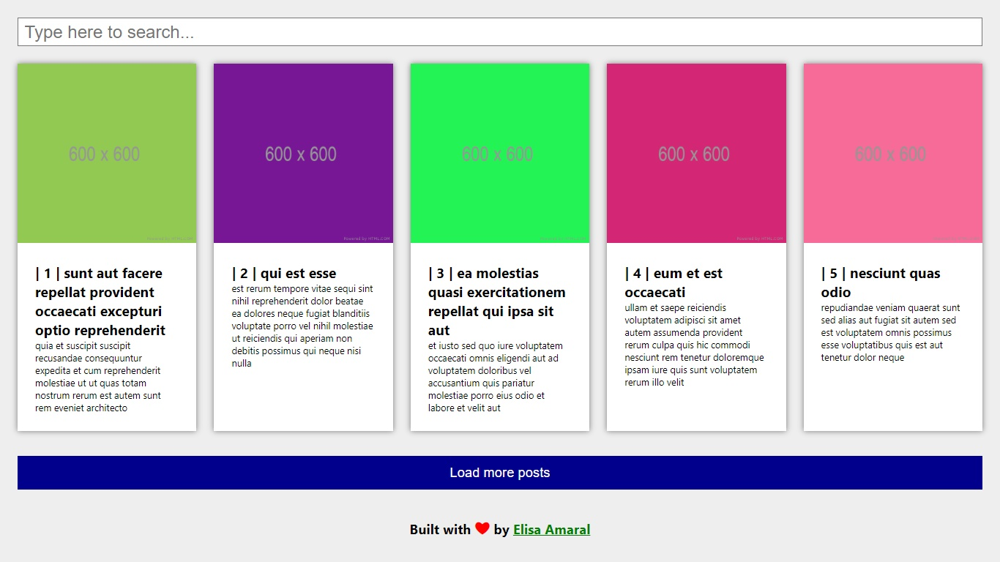
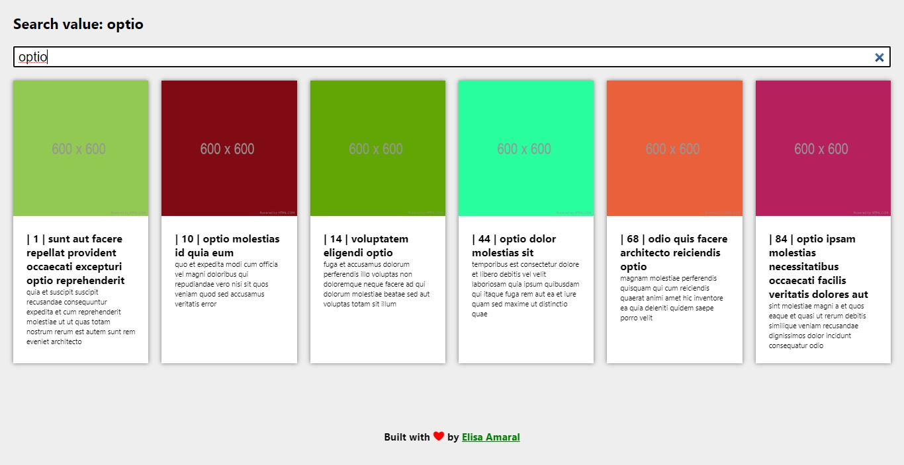

# Posts Pagination and Posts Search built with React.js

This is a posts pagination and posts search project built with React.js consuming the {JSON} Placeholder API as testing data (posts title, body text and photo). 

The project loads 100 posts in total and 100 images (one for each post), extracting 100 from the 5000 photos that the API provides.

The user can load posts (10 at a time) and searchs through the posts titles via a search bar. Notice that every post is written with placeholder Lorem Ipsum text, so the user must test the search feature with Latin words, such as "est", "aut" and "sunt", or with single letters ("a", "b", "c"...) 

## Project Website

https://post-pagination-and-search-in-reactjs.netlify.app/

## Project Demonstration Video

*coming soon*

## Screenshot 1: Posts Pagination

## Screenshot 2: Posts Search

## Technology Stack
+ React.js
+ JSX
+ JavaScript
+ HTML
+ CSS
+ [JSON Placeholder](https://jsonplaceholder.typicode.com/) | Free fake API for testing and prototyping
